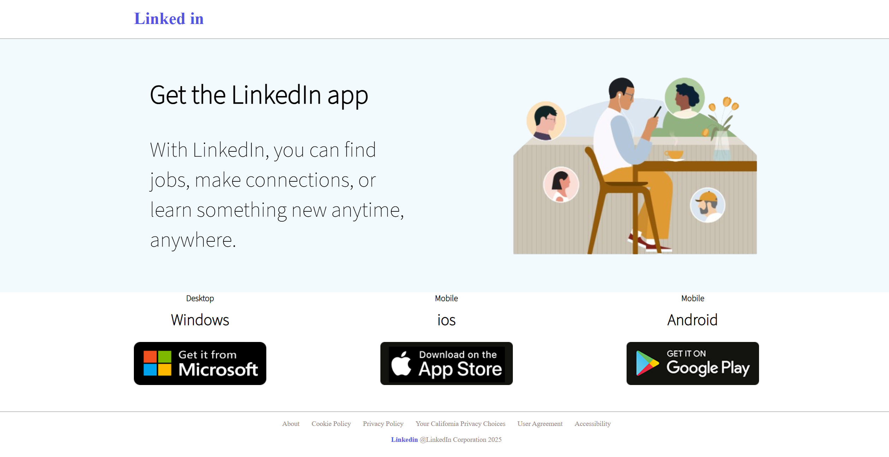

# LinkedIn Single Page Clone

This project is a single page UI clone of LinkedIn built using
HTML and CSS. It focuses on layout design
and visual structure.

## Features
- Clean LinkedIn-style layout
- Built using pure HTML and CSS
- Desktop-first UI

## Technologies Used
- HTML5
- CSS3

## Preview

## Purpose
This project was created to practice frontend development
skills and understand real-world UI layouts.

## Author
Varun Kumar Reddy
